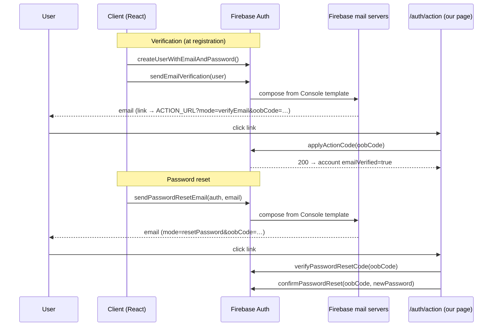
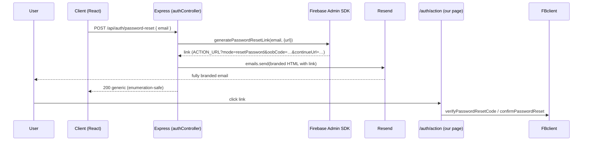

# Verification & password-reset email delivery — architecture review

**Audience:** senior engineer / architect reviewing the account-security email
path (email verification + password reset). Order/payment/shipment/welcome
emails already run through Resend and are out of scope.

**Decision required:** keep Firebase-sent security emails (**Option A**, shipped
in PR #19) or move them to backend-generated + Resend (**Option B**).

---

## 0. Shared foundation (applies to BOTH options)

These facts are invariant across the two options; the choice does **not** change
them.

### 0.1 The action-code (`oobCode`) model

Firebase's verification/reset flow is a signed one-time code (`oobCode`)
embedded in a link. Whoever sends the email, the **link handling** is identical:

```
https://<ACTION_URL>?mode=<action>&oobCode=<code>&apiKey=<key>&continueUrl=<url>&lang=<lang>
```

- `mode` ∈ `verifyEmail | resetPassword | recoverEmail | verifyAndChangeEmail | signIn`
- `oobCode` — single-use, server-side-generated, expiring credential
- `<ACTION_URL>` — governed by **Firebase Console → Authentication → Templates →
  Customize action URL** (a *global* per-project setting, applies to all
  templates). Default: `https://<project>.firebaseapp.com/__/auth/action`.

Our branded handler is [`src/pages/AuthActionPage.jsx`](../src/pages/AuthActionPage.jsx),
routed at `/auth/action` in [`src/App.jsx`](../src/App.jsx). It redeems codes via
the client SDK:

| mode | SDK call | file |
|---|---|---|
| `verifyEmail` / `recoverEmail` | `applyActionCode(auth, oobCode)` | [customerAuthService.js](../src/services/customerAuthService.js) `applyEmailVerificationCode` |
| `resetPassword` (validate) | `verifyPasswordResetCode(auth, oobCode)` → email | `verifyResetCode` |
| `resetPassword` (commit) | `confirmPasswordReset(auth, oobCode, newPassword)` | `confirmPasswordResetWithCode` |

### 0.2 `ActionCodeSettings` — what it does and does NOT do

This is the most common architectural misread. `ActionCodeSettings.url` sets the
**`continueUrl`** — where the user is sent *after* completing the action (the
"Continue" button target), or, with `handleCodeInApp: true`, the deep-link
target for a native app. **It does not replace the action handler page.**

```ts
interface ActionCodeSettings {
  url: string;                 // continueUrl (REQUIRED for Admin generate*Link)
  handleCodeInApp?: boolean;   // native deep-link handling; false for pure web
  iOS?: { bundleId: string };
  android?: { packageName: string; installApp?: boolean; minimumVersion?: string };
  linkDomain?: string;         // Hosting link domain (newer)
  dynamicLinkDomain?: string;  // DEPRECATED — Firebase Dynamic Links shut down 2025-08-25
}
```

**Consequence for both options:** to land users on our `/auth/action` page you
**must** set the Console custom action URL to
`https://eliteimpressions.co.in/auth/action`. Option B does not remove this
step.

### 0.3 `oobCode` expiry (fixed by Firebase, not tunable)

| Action | Default validity | Configurable? |
|---|---|---|
| Password reset | ~1 hour | No (not via `ActionCodeSettings`) |
| Email verification | ~3 days | No |

Single-use in both cases — a redeemed or expired code fails; our handler maps
that to a branded "This link didn't work" state.

### 0.4 Required Firebase project config (both options)

- `eliteimpressions.co.in` in **Authentication → Settings → Authorized domains**
  (else `auth/unauthorized-domain` on the handler).
- **Email Enumeration Protection** ON (Authentication → Settings) — affects the
  client SDK's reset behaviour (§A) and is the baseline the backend must not
  regress (§B).
- Providers enabled: Email/Password, Google, Phone.

---

## Option A — Firebase-sent (current, PR #19)

### A.1 Sequence



### A.2 API surface (client SDK, no `ActionCodeSettings`)

```js
// src/services/customerAuthService.js — as shipped
await sendEmailVerification(currentUser);          // registerCustomerWithEmail
await sendPasswordResetEmail(auth, email);         // sendCustomerPasswordReset
```

Token generation, send, expiry, single-use enforcement, and rate limiting are
all **Firebase-owned**. No server code, no queue, no template engine.

### A.3 Deliverability

- **Sender:** `noreply@<project>.firebaseapp.com` by default; "Customise domain"
  routes through a domain you own (adds SPF/DKIM records Firebase specifies).
- **SMTP:** default Firebase infrastructure, or your own SMTP under
  Templates → SMTP settings.
- Reputation is Firebase's (default) or shared with your domain (custom).

### A.4 Enumeration / abuse

- With Email Enumeration Protection ON, `sendPasswordResetEmail` resolves
  identically whether or not the address exists — no oracle.
- Client already hedges copy ("If an account exists for X…") and rate-limits
  resends with a 60s cooldown ([CustomerLoginCard.jsx](../src/components/CustomerLoginCard.jsx)).
- Per-project send quotas enforced by Firebase.

### A.5 Observability

- **Limited.** No per-message delivery log unless you run custom SMTP with a
  provider that exposes logs. You see Firebase Auth usage metrics, not
  individual sends.

### A.6 Failure modes

| Failure | Effect | Mitigation |
|---|---|---|
| Firebase Auth down | No auth at all | Provider-level; nothing app-side |
| Email in spam | User doesn't verify/reset | Custom sending domain + template hygiene |
| Console action URL unset | Links land on Firebase default page (works, unbranded) | Set action URL |
| Handler page 404 (deployed before page live) | Broken links | Sequence: deploy page → then set action URL |

### A.7 Net

Lowest complexity, lowest blast radius, weakest branding & observability.
**Done** — needs only Console config.

---

## Option B — backend-generated (Admin SDK) + Resend

### B.1 Sequence



Note: the **handler side (H)** is unchanged from Option A — still the client SDK
on `/auth/action`. Only *email generation + send* moves to the backend.

### B.2 Admin SDK surface (exact)

`server/config/firebaseAdmin.js` already initializes the Admin app and exposes
`getAuth()` via the private `requireAdminAuth()` (which throws a 503 when
`FIREBASE_ADMIN_*` is unset). New wrappers would sit beside `verifyFirebaseIdToken`:

```js
// server/config/firebaseAdmin.js (additions)
const ACTION_CODE_SETTINGS = {
  url: `${appConfig.storefrontUrl}/auth/action`, // continueUrl; NOT the handler
  handleCodeInApp: false,
};

export const buildPasswordResetLink = (email) =>
  requireAdminAuth().generatePasswordResetLink(email, ACTION_CODE_SETTINGS);

export const buildEmailVerificationLink = (email) =>
  requireAdminAuth().generateEmailVerificationLink(email, ACTION_CODE_SETTINGS);
```

Return value: a fully-formed URL string (mode + oobCode + apiKey + continueUrl).
**Throws** on unknown user:

| Method | Throws when | Enumeration implication |
|---|---|---|
| `generatePasswordResetLink(email, s)` | `auth/user-not-found` | endpoint MUST swallow → generic 200 |
| `generateEmailVerificationLink(email, s)` | `auth/user-not-found` | only called for a just-created / signed-in user, so lower risk |

### B.3 New backend endpoints

```js
// server/controllers/authController.js (additions)
export const requestPasswordReset = async (req, res) => {
  const email = normalizeEmail(req.body.email || "");
  if (!isValidEmail(email)) return res.status(400).json({ message: "Enter a valid email." });

  try {
    const link = await buildPasswordResetLink(email);
    await sendPasswordResetBrandedEmail(email, link); // Resend, never throws
  } catch (error) {
    // CRITICAL: user-not-found must look identical to success. Only surface
    // infra failures (503 admin unconfigured), never existence.
    if (error?.code && error.code !== "auth/user-not-found") {
      // log server-side, still return generic below
    }
  }
  // Always generic — no oracle.
  return res.json({ message: "If an account exists for that email, a reset link is on its way." });
};
```

`server/routes/authRoutes.js`:

```js
router.post("/password-reset", authRateLimiter, requestPasswordReset);
router.post("/verify-email/send", authenticateCustomer, authRateLimiter, requestEmailVerification);
```

### B.4 Resend templates

Two new files under `server/services/email/templates/` returning
`{ subject, html, text }`, built with the existing `renderLayout` / `button`
helpers from `templates/layout.js`, dispatched through the existing
`sendEmail({ to, subject, html, text, template })` in
[`resendService.js`](../server/services/email/resendService.js) (which never
throws and logs `queued/sent/failed`).

```js
// server/services/email/templates/passwordReset.js
export const passwordReset = (email, link) => ({
  subject: "Reset your Elite Impressions password",
  html: renderLayout({
    heading: "Reset your password",
    body: `<p>We received a request to reset the password for ${escapeHtml(email)}.</p>
           ${button("Reset my password", link)}
           <p>This link expires in about an hour and can be used once.</p>`,
  }),
  text: `Reset your password: ${link}`,
});
```

### B.5 Client rewiring

`sendCustomerPasswordReset` / verification resend switch from the Firebase client
functions to `fetch` against the new endpoints. The `/auth/action` redeem path is
unchanged.

### B.6 Security / abuse surface (new, must be built)

| Concern | Requirement |
|---|---|
| Enumeration | `user-not-found` → generic 200 (see B.3). Verify with a test. |
| `oobCode` in logs | Never log the generated link/oobCode. `logEmail` logs `template`+`to`+Resend id only — do not add the link. |
| Rate limiting | New `authRateLimiter` (per-IP + per-email). No global limiter exists today; OTP has its own store-level cooldown — mirror that or add `express-rate-limit`. |
| Endpoint auth | Reset endpoint is public (must be). Verification-send endpoint requires `authenticateCustomer`. |
| Reset resend cooldown | Server-side cooldown to complement the client's 60s. |

### B.7 Deliverability

- **Sender:** `@eliteimpressions.co.in` (Resend-verified; SPF/DKIM/DMARC already
  configured for order emails). Consistent identity across all mail.
- Consider a subdomain (e.g. `auth@` vs marketing) if you later separate
  reputations; not required.

### B.8 Observability

- Full: Resend dashboard + `logEmail` lines (`queued/sent/failed`, Resend id).
  Same telemetry as order emails.

### B.9 Failure modes (heavier than A)

| Failure | Effect | Mitigation |
|---|---|---|
| **Resend outage** | **No verification/reset emails → account access blocked** | Optional fallback: catch send failure, fall back to Firebase client `sendPasswordResetEmail`. Adds complexity. |
| Admin SDK unconfigured (`FIREBASE_ADMIN_*`) | 503 on link generation | Already guarded by `requireAdminAuth()`; monitor. |
| Endpoint abused for spam | Mailbox bombing a victim | `authRateLimiter` + cooldown |
| Link generated, email fails silently | User waits forever | `sendEmail` returns `{sent:false}` — surface to caller, allow retry |

### B.10 Rollout / rollback

- Gate behind a flag (e.g. `EMAIL_SECURITY_PROVIDER = firebase | resend`) so you
  can flip back to Option A instantly without a deploy.
- No schema/state change → rollback is config-only.

### B.11 Testing

- Endpoint: unknown email → 200 generic (enumeration test), valid email → Resend
  send invoked with a link, Admin unconfigured → 503.
- Resend mocked (as `orderNotifications.test.js` already does).
- `/auth/action` redeem unchanged (existing coverage).

---

## Comparison matrix

| Dimension | A — Firebase-sent | B — Admin SDK + Resend |
|---|---|---|
| Email body branding | Console template (limited HTML) | Full custom HTML |
| Sender domain | Firebase default / custom | `@eliteimpressions.co.in` |
| Code to write | **0** | 2 Admin wrappers, 2 endpoints, 2 templates, client rewire, tests |
| New runtime deps in critical path | Firebase only | Firebase **+ Resend** |
| Console custom action URL required | Yes | Yes |
| `oobCode` generation | Firebase (opaque) | Your backend (explicit) |
| Enumeration safety | Built-in (setting) | **You implement** |
| Rate limiting | Firebase quotas | **You implement** (+ Firebase quotas) |
| Deliverability control | Low (unless custom domain) | High (own domain/reputation) |
| Per-send observability | None (default) | Full (Resend + logs) |
| Blast radius of email outage | Firebase-wide only | Resend outage blocks account access |
| Rollback | N/A | Config flag |
| Maintenance | Lowest | Higher |

## Threat model delta (A → B)

Moving to B **transfers** three responsibilities from Firebase to your code:
1. **Enumeration protection** on the reset endpoint (Firebase gave it free).
2. **Rate limiting / anti-abuse** on public send endpoints.
3. **Secret hygiene** — the generated link contains a live `oobCode`; it must
   never reach logs, error trackers, or analytics.

None are hard, but they are net-new attack surface that A doesn't have.

## Recommendation

**Ship A. Adopt B only if** brand-matched account-security emails are a stated
requirement. B is a clean, additive, flag-gated follow-up (est. ~half a day +
tests) that reuses the entire `/auth/action` redeem path and the existing Resend
`sendEmail` pipeline — it swaps *only* the generation+send half. Do not adopt B
for observability alone; a custom SMTP under Option A gets most of that at far
lower risk.

### Decision criteria

- Brand parity with order emails is a hard requirement → **B**
- Account-recovery must survive a Resend outage → **A** (or B + fallback)
- Minimize security surface & maintenance → **A**
- Want all mail in one Resend dashboard → **B**

---

## Appendix — env & config touchpoints

| Item | A | B |
|---|---|---|
| `FIREBASE_ADMIN_*` (server) | used for token verify | **also** link generation |
| `RESEND_API_KEY` | order mail only | **+ security mail** |
| `EMAIL_FROM` / `storefrontUrl` (`appConfig`) | — | sender + `continueUrl` base |
| Console: Authorized domains | required | required |
| Console: Custom action URL → `/auth/action` | required | required |
| Console: template copy / sender name | **the branding surface** | unused for these two |
| New flag `EMAIL_SECURITY_PROVIDER` | — | firebase \| resend |
